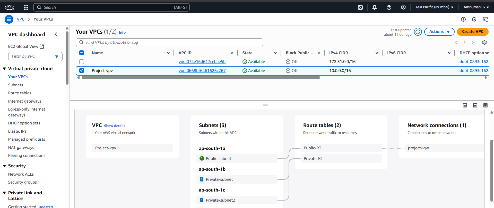
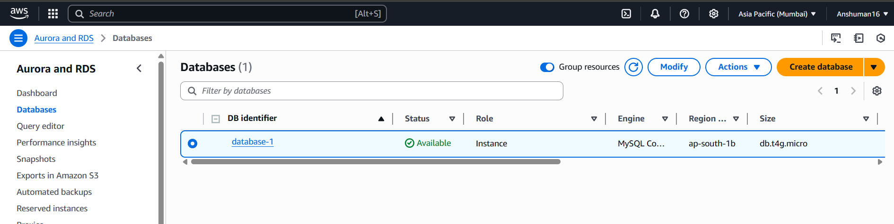
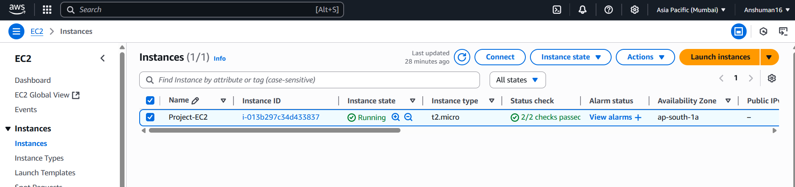

# 🏗️ AWS Two-Tier Architecture Project: WordPress on EC2 with RDS Backend

## 📌 Project Overview

This hands-on project demonstrates the deployment of a secure "Two-tier architecture" on AWS, using a custom Virtual Private Cloud (VPC) and proper infrastructure segmentation. The application layer is hosted on an EC2 instance (public subnet), while the data layer uses Amazon RDS (private subnet), following AWS best practices for security and scalability.

---

## 🧩 Architecture Components

- ✅ **Custom VPC** with carefully planned CIDR blocks for network segmentation.
- ✅ **Public Subnet**:
  - Hosts an **Amazon EC2** instance running a WordPress site.
  - Attached to an **Internet Gateway (IGW)** for public access.
- ✅ **Private Subnet**:
  - Contains an **Amazon RDS (MySQL)** database.
  - **No internet access**, improving data security.
- ✅ **Security Groups**:
  - EC2 Security Group allows HTTP/HTTPS access from the internet.
  - RDS Security Group allows MySQL access **only from the EC2 instance**.
- ✅ **Routing Tables** and **Network ACLs** configured to enforce network traffic rules.

---

## 🚀 Deployment Steps

1. **Create a VPC** with appropriate CIDR (e.g., `10.0.0.0/16`).
2. **Create subnets**:
   - Public Subnet (e.g., `10.0.1.0/24`)
   - Private Subnet (e.g., `10.0.2.0/24`)
3. **Attach an Internet Gateway** and configure the route table for the public subnet.
4. **Launch an EC2 instance** in the public subnet and install WordPress + Apache + PHP.
5. **Provision an RDS MySQL instance** in the private subnet.
6. **Update WordPress configuration** (`wp-config.php`) with RDS credentials.
7. **Secure the environment** using Security Groups and subnet isolation.

---

## 💻 Tools & AWS Services Used

- **Amazon VPC**
- **Amazon EC2**
- **Amazon RDS (MySQL)**
- **Subnets (Public & Private)**
- **Security Groups**
- **Route Tables**
- **Internet Gateway**

---

## 🎯 Outcome & Impact

- ✅ Deployed a **publicly accessible WordPress blog** using EC2.
- ✅ Backend data is securely managed via **Amazon RDS in a private subnet**.
- ✅ Achieved **clean separation** between the application and data layers.
- ✅ Gained real-world experience in **AWS networking, compute, and database services**.

📽️ [Download Demo Video](media/Untitled video - Made with Clipchamp (2).mp4)

---

## 📷 Architecture Diagram

---

## 📚 Lessons Learned

- Deepened understanding of AWS networking, subnetting, and secure infrastructure setup.
- Gained practical experience with deploying and configuring WordPress on AWS.
- Improved knowledge in secure database connectivity and instance access control.

---

## 🔖 Tags

`#AWS` `#VPC` `#EC2` `#RDS` `#WordPress` `#DevOps` `#Networking` `#CloudComputing` `#ProjectShowcase` `#CloudEngineer`

---

